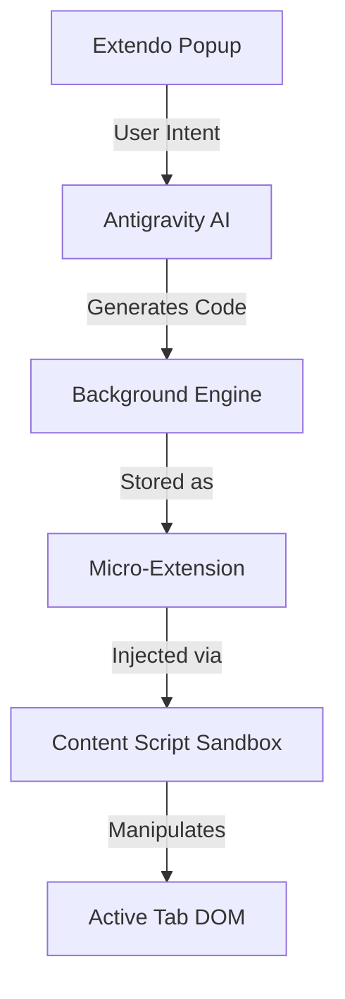

# Extendo Documentation

Current Version: 0.1.0 (Genesis)

## Architecture Overview
Extendo is an **Extension Function Engine**. It does not just provide tools; it injects new logic into the browser at runtime using `chrome.scripting`.

## Developer Guide
### Commands
*   `npm run dev`: Start HMR server.
*   `npm run build`: Production build to `dist/`.
